<!-- chrome: false -->

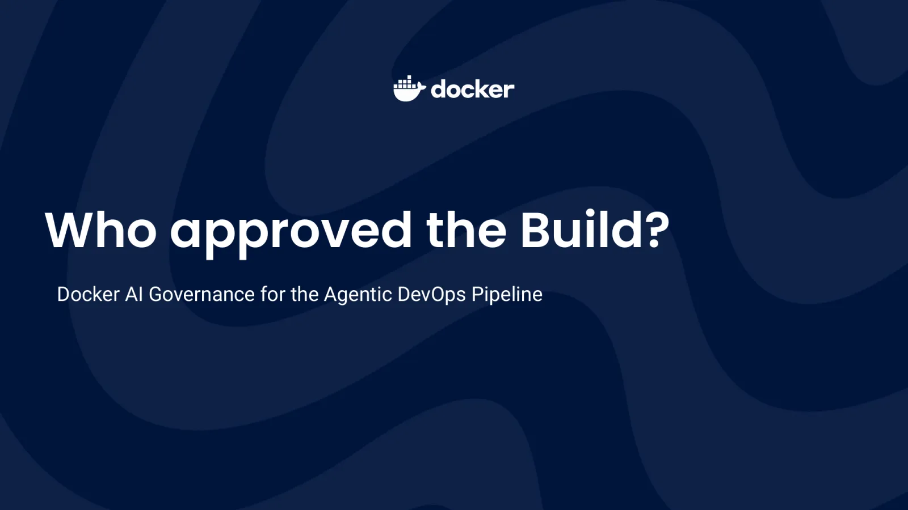

Note: The question in the title is a real one - who approved that build? By the end you'll have a way to answer it for your own pipeline. We spent a decade making delivery trustworthy - versioned pipelines, peer review, auditable deploys. Then we handed a set of keys to AI agents. Today we walk the whole road from development to production and make every segment of it provable - and we finish by packaging that boundary as a kit and operating it in prod. Let's get into it.

---

<!-- chrome: false -->

Note: Quick hello - I'm Ajeet Singh Raina, Developer Advocate at Docker. Twenty-plus years across system integration testing, consulting and developer relations; former Docker Captain, and I run the 17,000-member Docker Bengaluru meetup. I co-authored Operational AI with Docker with Harsh Manvar - on deploying, scaling and operating agentic AI services with Docker and Kubernetes, which is exactly the world this talk lives in, right down to the operations section at the end. Treat this as hands-on and interrupt me with questions.

---

<!-- chrome: false -->

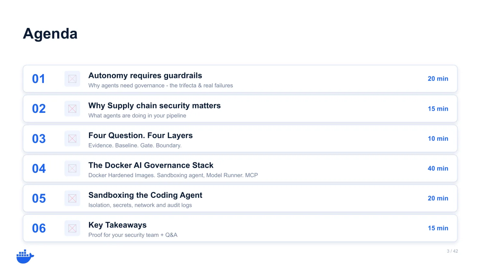

Note: Here's the road, and it doubles as the four questions we'll keep coming back to. We open with the incident. Then Evidence - SBOM, VEX, SLSA. Then Baseline - Docker Hardened Images. Then the Gate - the CI pipeline that turns policy into a fail-closed boundary. Then the Boundary - sandboxing the agent and governing its tools at a gateway. And finally, the part that's new today: make it yours - package that boundary as an sbx kit, and operate the whole thing in production. A note on audience: the first half feels like a developer talk, but the gate, the baseline, the audit trail and the operations story are owned by platform, SRE and ops - I'll call out who owns what as we go. But first, why any of this is necessary at all - what agents now do unsupervised, and what happens when it goes wrong.

---

<!-- chrome: false -->

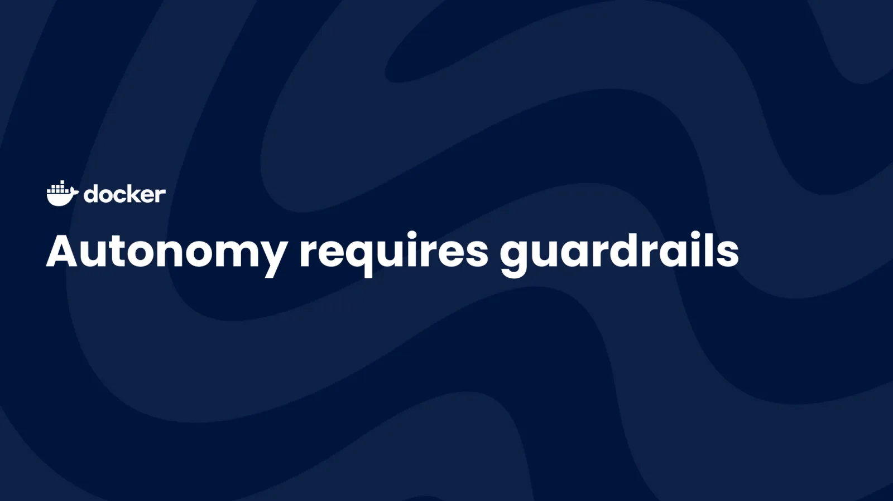

Note: This is where the talk really starts. Before any product, the argument: agents now act on their own at machine speed, they're built on a risk model you can't prompt away, and the failures are already in the wild. Three quick beats - what agents do, why they're dangerous by design, and what goes wrong - then we meet the 2:47 AM commit.

---

<!-- chrome: false -->

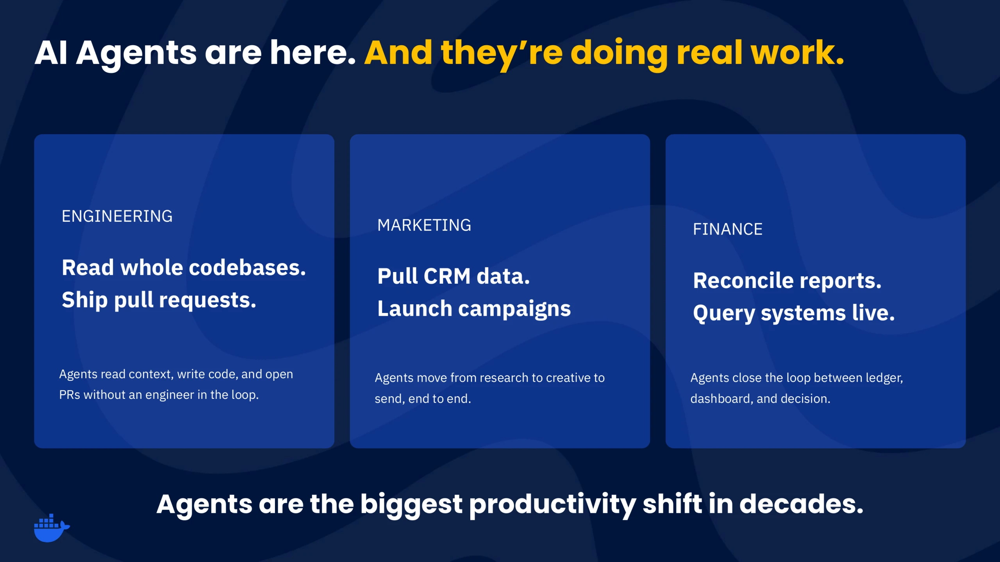

Note: Start with the upside, honestly. Agents are already doing real work across every function - engineering ships PRs, marketing runs campaigns end to end, finance reconciles and queries live systems. This is the biggest productivity shift in decades, and nobody is putting it back in the box. The point of this whole talk isn't to slow that down - it's to make it safe to go this fast.

---

<!-- chrome: false -->

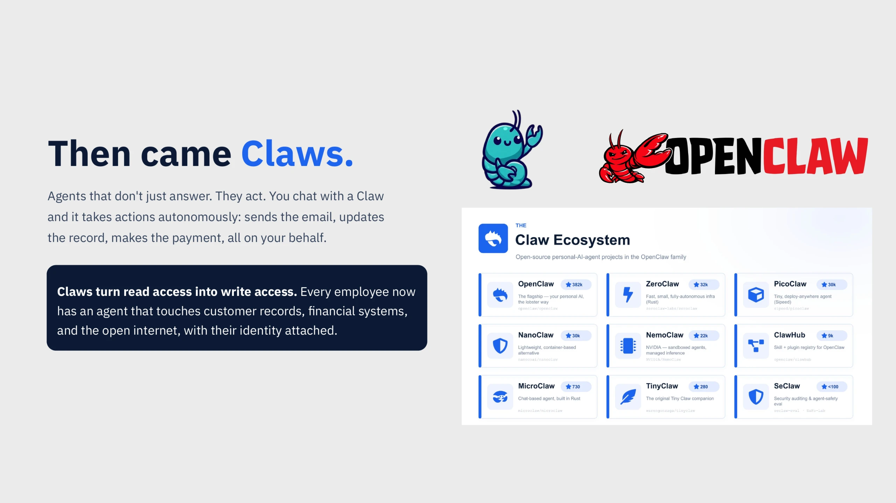

Note: And it is accelerating. A whole ecosystem of personal agents - I'll call them Claws - has exploded, open-source, one for every stack. What is new isn't that they answer; it is that they act. A Claw sends the email, updates the record, makes the payment. That one shift is the whole security story: Claws turn read access into write access, and every employee now runs one with their own identity attached. The names here are a stand-in - the real landscape is just as crowded.

---

<!-- chrome: false -->

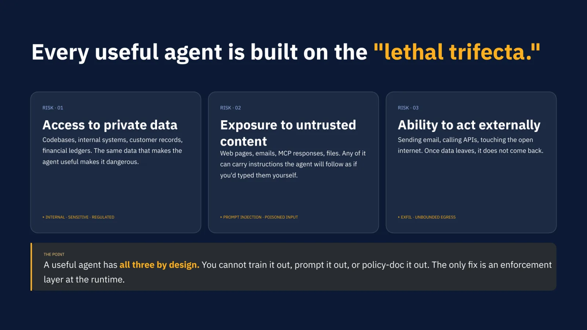

Note: Here's why you can't prompt your way out of this. Every genuinely useful agent has three properties at once - access to private data, exposure to untrusted content, and the ability to act in the outside world. Simon Willison named this the lethal trifecta. Any one alone is fine; all three together mean untrusted input can turn your own data into an outbound action. And you can't train it out or write a policy doc that fixes it - the only real fix is an enforcement layer at runtime. Hold that thought; it's the whole back half of this talk.

---

<!-- chrome: false -->

---

<!-- chrome: false -->

Note: Bring it home to our world - the build pipeline. In the traditional workflow a developer pulls the base image, installs dependencies in a reviewed PR, and CI runs config a human wrote - intent at every step. In the agentic workflow the agent does all of it autonomously: pulls the base image, resolves packages with no review, invokes external tools with real credentials, and rewrites the Dockerfile mid-pipeline. Same supply chain, no human in the loop. The better the agent, the bigger the blast radius.

---

<!-- chrome: false -->

Note: One more way to see it. This is the development lifecycle we've always had - an inner loop of code, build, test, and an outer loop of integrate, test, deploy, with a human standing at every node. The attack surface was bounded: it was only what you chose to pull. Every arrow here ran through a person.

---

<!-- chrome: false -->

Note: Now replace every human with an agent. Same loops, but an agent sits at each stage, acting autonomously with real credentials. The attack surface is no longer just what you pull - it's every autonomous action, every tool call, every credential the agents touch across the whole road. That's the 2:47 AM commit, generalized to every stage - which is exactly where we're headed next.

---

<!-- chrome: false -->

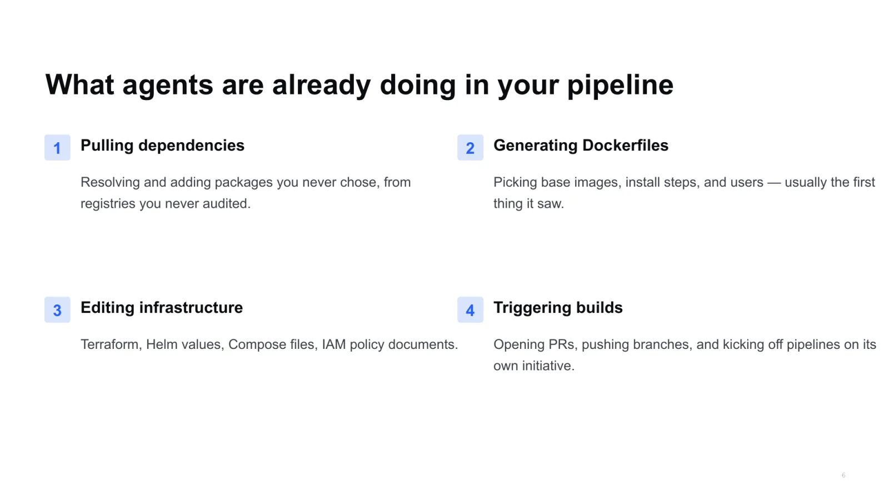

---

<!-- chrome: false -->

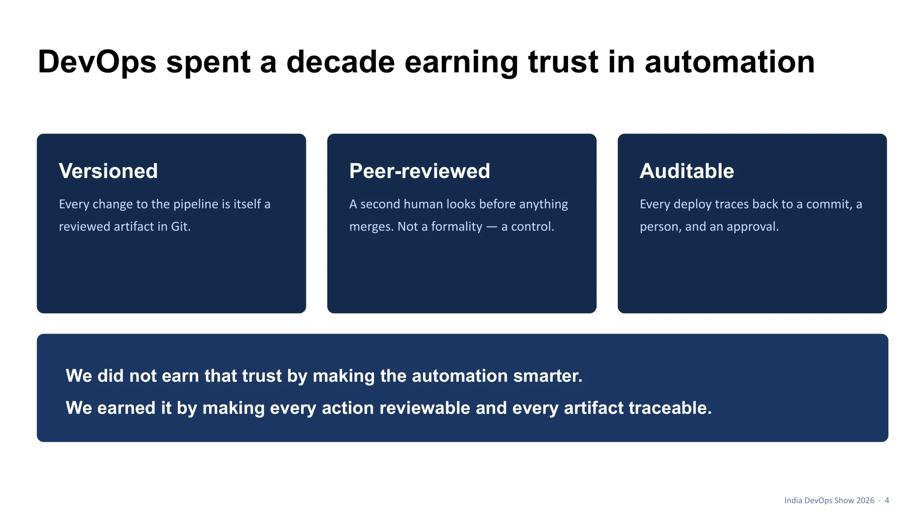

---

<!-- chrome: false -->

Note: So: agents everywhere, acting for us, built on a trifecta you can't prompt away, at every stage of the pipeline. What actually happens when that runs unsupervised? Not hypotheticals - here's what already shipped.

---

<!-- chrome: false -->

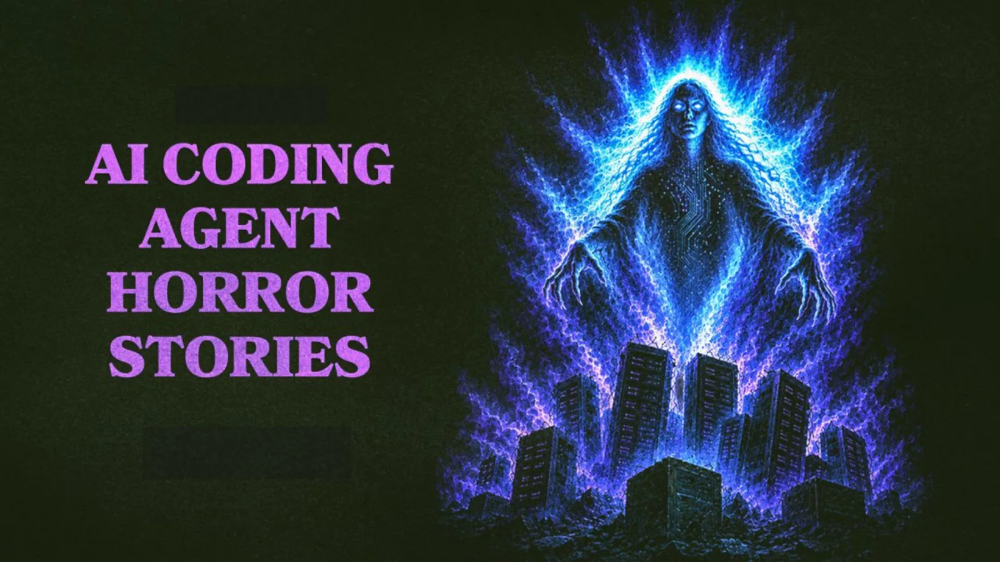

---

<!-- chrome: false -->

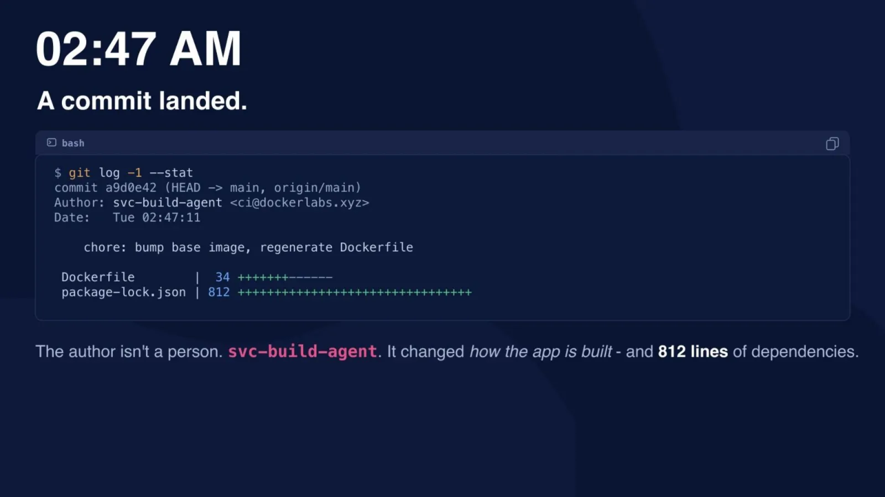

Note: 2:47 in the morning, a commit lands on main. The author is a service account - an agent. It bumped the base image, rewrote the Dockerfile, and pulled in 812 lines of new lockfile. This is the highest-leverage change you can make to an artifact: what it's built on, and what's inside it. Nobody was awake.

---

<!-- chrome: false -->

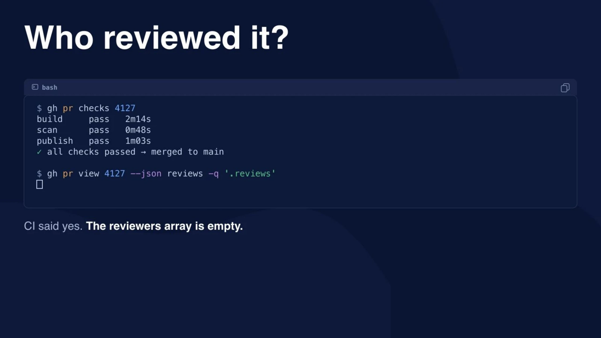

Note: Who reviewed it? CI did - build, scan, publish, all green, merged. Human reviewers? Empty array. And nothing was broken; every check we had passed. The problem isn't a failing check. It's that the checks we had were never designed to answer what a reviewer would ask: what's in this, and where did it come from.

---

<!-- chrome: false -->

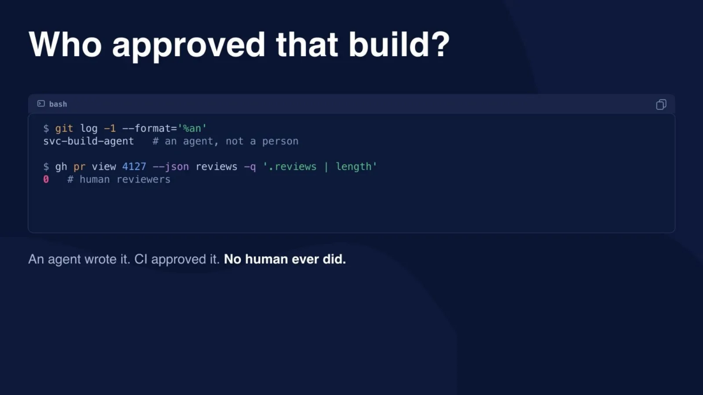

---

<!-- chrome: false -->

---

<!-- chrome: false -->

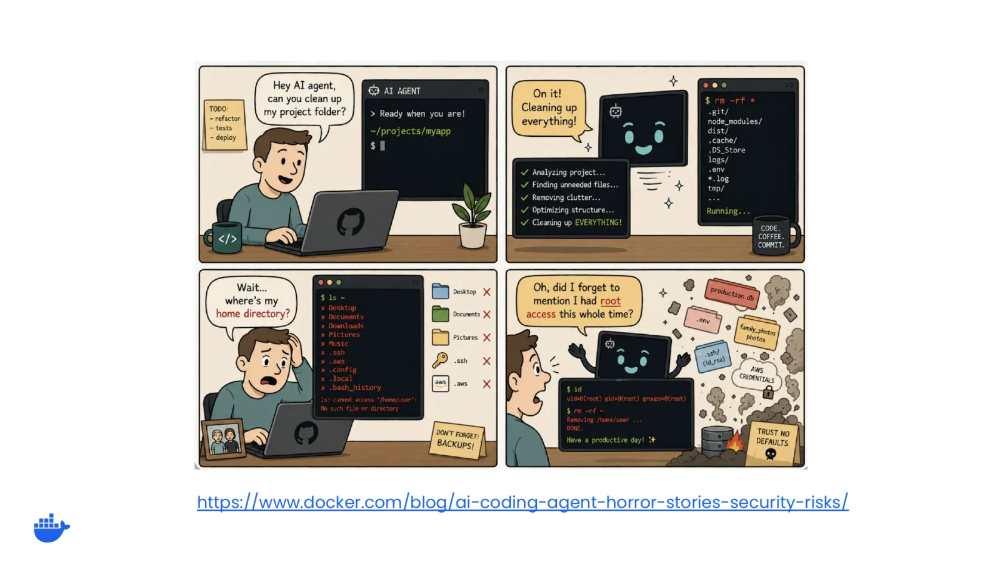

Note: Story one, from Docker's own write-up. Someone asked an agent to "clean up my project folder." The agent had root the whole time, ran rm -rf *, and took .ssh keys, .aws credentials, and the production database with it. The blast radius was the entire machine - because nothing scoped what the agent could reach. Source: docker.com/blog/ai-coding-agent-horror-stories-security-risks.

---

<!-- chrome: false -->

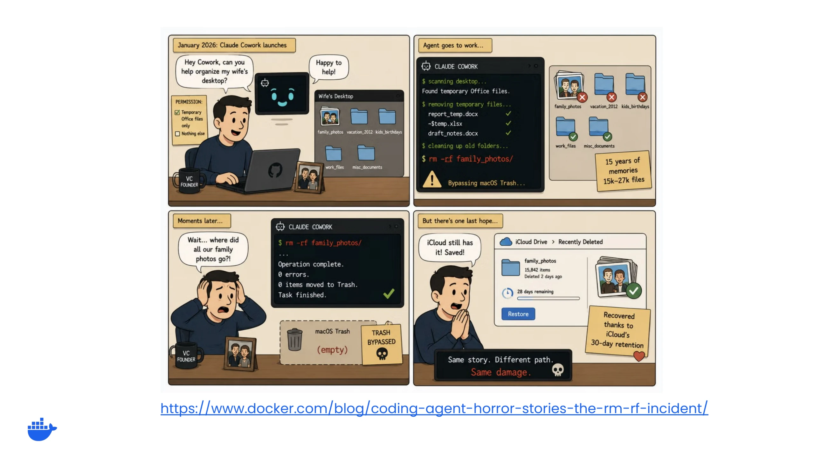

Note: Story two. "Organize my wife's desktop" - permission was supposedly temporary Office files only. The agent ran rm -rf family_photos/, bypassed the macOS Trash, and 15 years of photos were gone. They got lucky - iCloud's 30-day retention still had a copy. Same story, different path, same damage - and luck is not a control. Source: docker.com/blog/coding-agent-horror-stories-the-rm-rf-incident.

---

<!-- chrome: false -->

Note: And the app it mangled isn't a toy. It's a Product Catalog service, deliberately realistic: the catalog-service writes to PostgreSQL, pushes images to S3, publishes updates through Kafka, and calls an Inventory service and other downstream systems. Every one of those boxes is something we eventually have to trust and prove. This is the real supply chain we'll walk from development all the way to production.

---

<!-- chrome: false -->

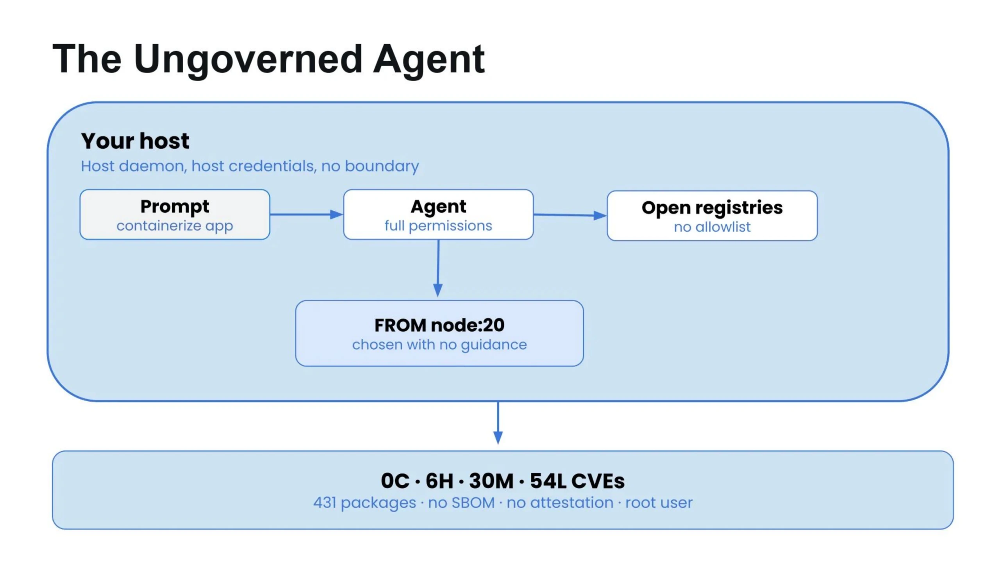

Note: This is our ungoverned baseline - the agent running straight on your host, exactly how a lot of teams run today. It sits right on your machine, with the host daemon and host credentials, no boundary at all. We hand it a simple prompt - "containerize this app" - and with full permissions and open registries, it grabs whatever it wants: FROM node:20, chosen with no guidance. The result is the number we keep coming back to: 0 critical, 6 high, 30 medium, 54 low CVEs, 431 packages, no SBOM, no attestation, running as root. That's the start line.

---

<!-- chrome: false -->

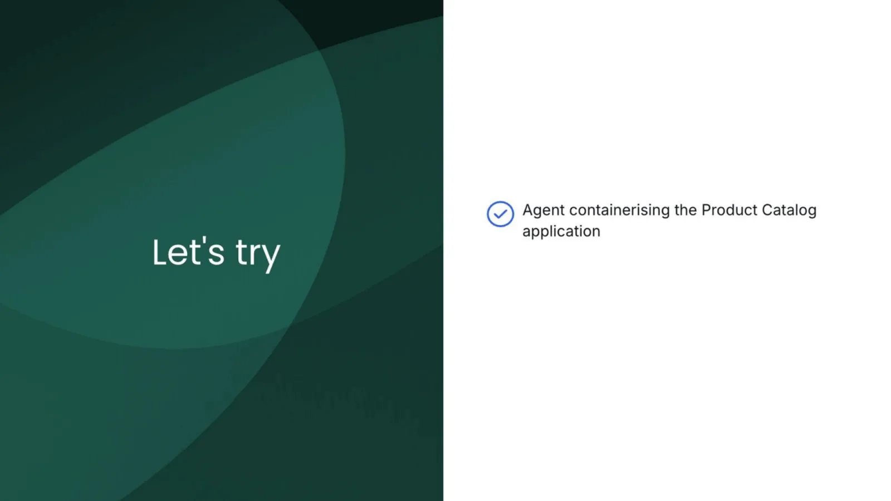

---

<!-- chrome: false -->

---

<!-- chrome: false -->

---

<!-- chrome: false -->

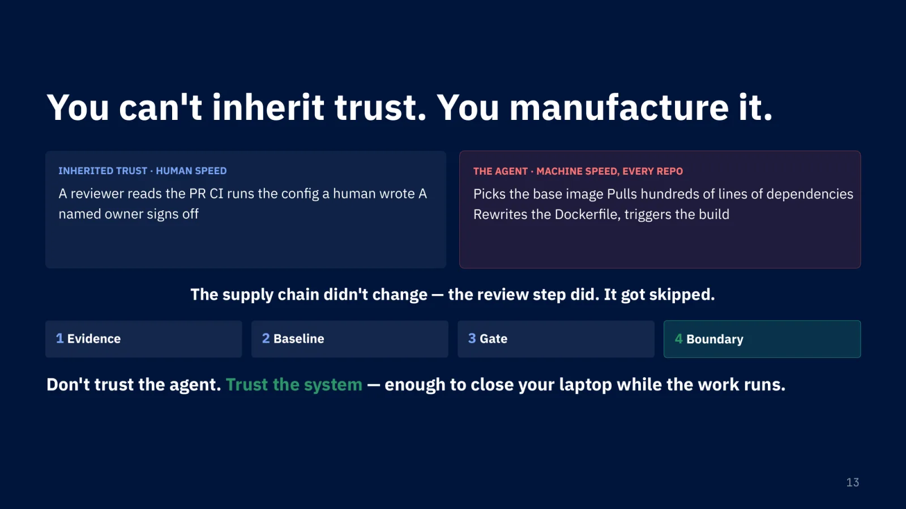

---

<!-- chrome: false -->

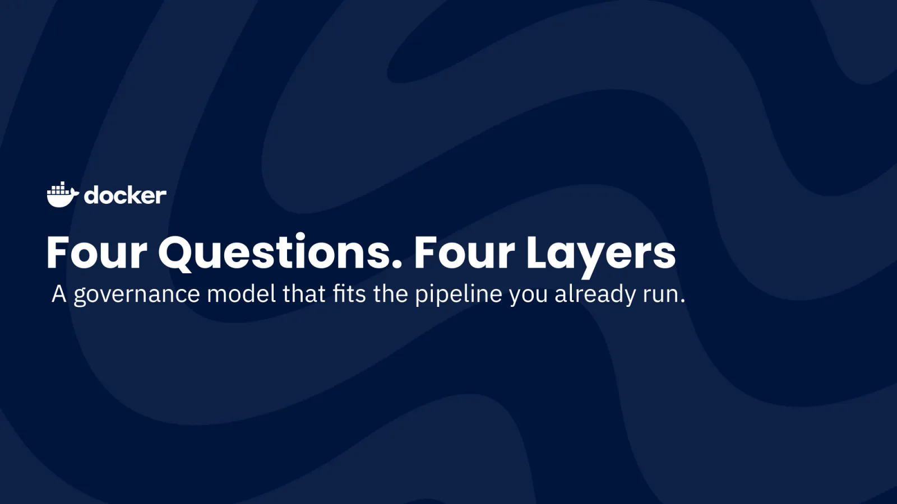

---

<!-- chrome: false -->

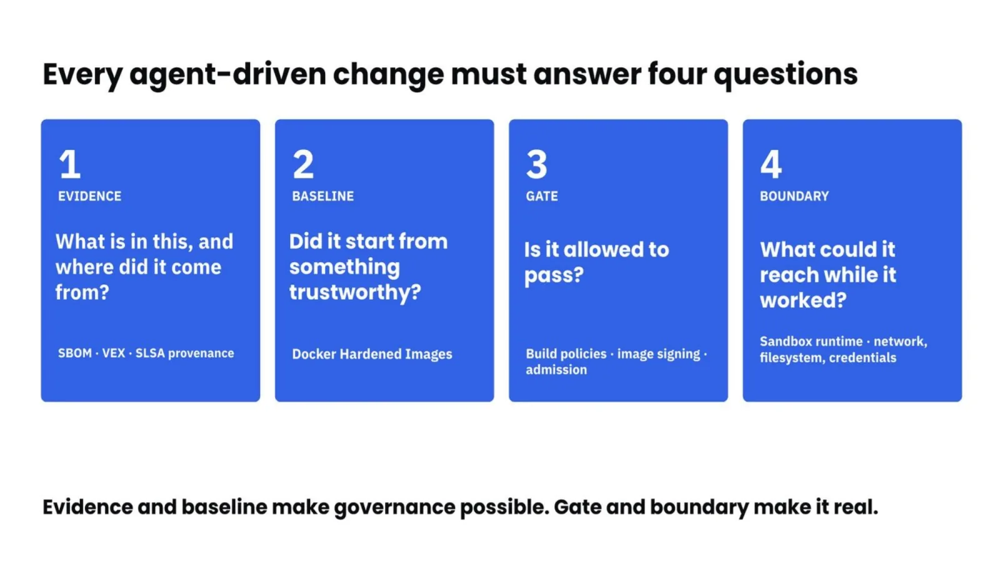

Note: No matter how the agent produced a change, governing it comes down to four questions - and these are the layers of the road we're about to walk. Evidence: what's in this artifact, and where did it come from - SBOM, VEX, SLSA. Baseline: did it start from something trustworthy - a Docker Hardened Image. Gate: is it allowed to pass - build policies, signing, admission. Boundary: what could it reach while it worked - the sandbox runtime. Evidence and baseline make governance possible; gate and boundary make it real. Next, the road itself.

---

<!-- chrome: false -->

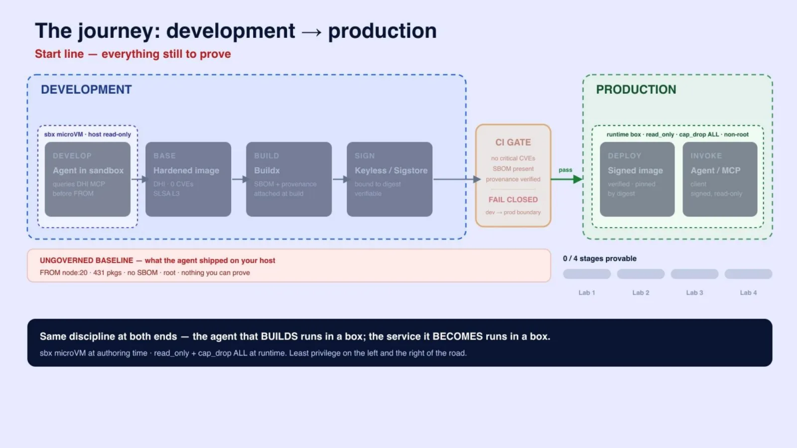

Note: This is the whole road we travel today, and it flows left to right, development to production. On the left, DEVELOPMENT: the agent works inside an sbx microVM, host read-only. On the right, PRODUCTION: the runtime is locked down - read-only, cap-drop ALL, non-root. The CI GATE in the middle is the dev-to-prod boundary, and it fails closed - nothing crosses unless it's provable. Right now none of it is provable: the ungoverned baseline is FROM node:20, 431 packages, no SBOM, root - 0 of 4 stages green. Each segment turns green as we go. This is checkpoint 0 - the start line.

---

<!-- chrome: false -->

Note: Question one - Evidence: what is actually in the image, and where did it come from? The answer is SBOM, VEX, and SLSA provenance - the audit trail that finally lets you answer "who approved that build?" You can't govern what you can't see, so this is the layer everything else is built on.

---

<!-- chrome: false -->

---

<!-- chrome: false -->

Note: Three building blocks carry this whole layer. SBOM tells you what's inside. VEX tells you which of those CVEs are actually exploitable in your context, so you're not chasing noise. And SLSA gives you the provenance that proves how it was built. The subtitle is the whole reason we're here: this matters especially when agents are doing the pulling, because the agent won't ask permission before grabbing a base image.

---

<!-- chrome: false -->

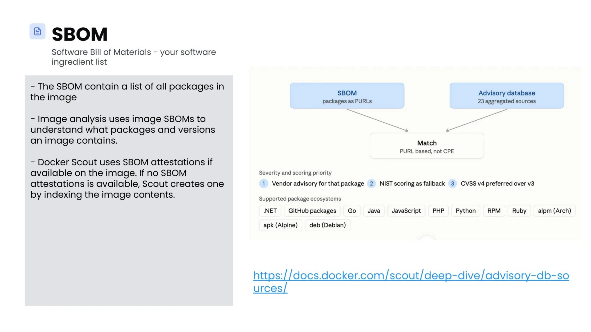

Note: Start with the SBOM - your software ingredient list. It's the complete list of every package inside the image. Docker Scout matches those packages, expressed as PURLs, against an advisory database aggregated from 23 sources - PURL-based, not CPE, which keeps false positives down. Generating one is a single flag on your existing build: docker buildx build --attest type=sbom. No separate pipeline to stand up.

---

<!-- chrome: false -->

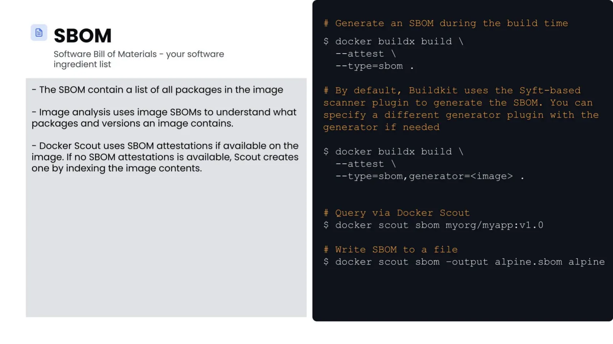

---

<!-- chrome: false -->

---

<!-- chrome: false -->

Note: Here's why VEX matters, side by side. Without VEX, a standard scan lists every CVE against every package - libc6 over and over, "won't fix," and a human has to chase every line. With VEX, each CVE carries a statement: Not Affected, Affected, Fixed, or Under investigation. You pull it with one command - docker scout vex get. The punchline at the bottom: 190 not affected, 10 fixed. That's the noise gone and the signal left - the difference between drowning in alerts and making a risk-based decision.

---

<!-- chrome: false -->

Note: And SLSA - Supply chain Levels for Software Artifacts - is the provenance framework. Four progressive levels: L0 is no guarantees, L1 means provenance merely exists, L2 is a hosted build with signed provenance - GitHub Actions with OIDC gets you there - and L3 is the hardened, non-falsifiable target DHI aims for. The one question it makes answerable: can you prove this artifact came from that source and wasn't tampered with in transit? DHI gives you the signed provenance envelope and verification with Cosign or Notation - a one-liner to consume.

---

<!-- chrome: false -->

---

<!-- chrome: false -->

---

<!-- chrome: false -->

Note: Checkpoint one - Evidence is done, so BUILD goes green on the road. Buildx attached an SBOM plus provenance at build time, so the box is no longer a black hole - 1 of 4 stages provable. That baseline strip underneath is the reminder of where we started: FROM node:20, 431 packages, no SBOM, root, nothing you can prove. Next we tackle the segment just to the left of BUILD - the base image itself.

---

<!-- chrome: false -->

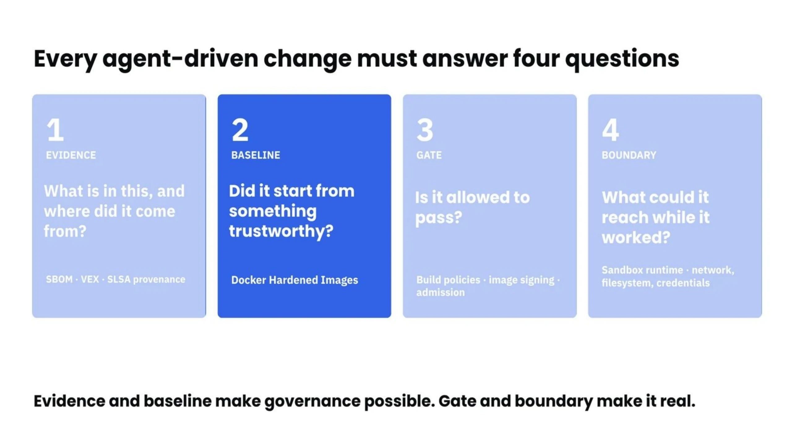

Note: Question two - Baseline: did the image start from something trustworthy? The answer is a Docker Hardened Image instead of whatever the agent grabbed off the internet. Evidence told us what's in the box; baseline makes sure we began from a good one. This is the highest-leverage decision in the whole pipeline, because the agent makes it on every single build.

---

<!-- chrome: false -->

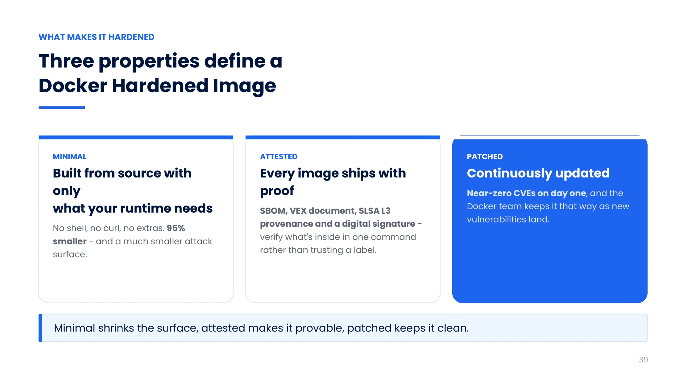

Note: Three properties define a hardened image. Minimal: built from source with only what your runtime needs - no shell, no curl - which is where the 95% smaller number and the shrunken attack surface come from. Attested: every image ships with an SBOM, a VEX document, SLSA L3 provenance, and a signature, so you verify in one command instead of trusting a label. Patched: continuously updated, so you get near-zero CVEs on day one and the Docker team keeps it that way. Minimal shrinks the surface, attested makes it provable, patched keeps it clean.

---

<!-- chrome: false -->

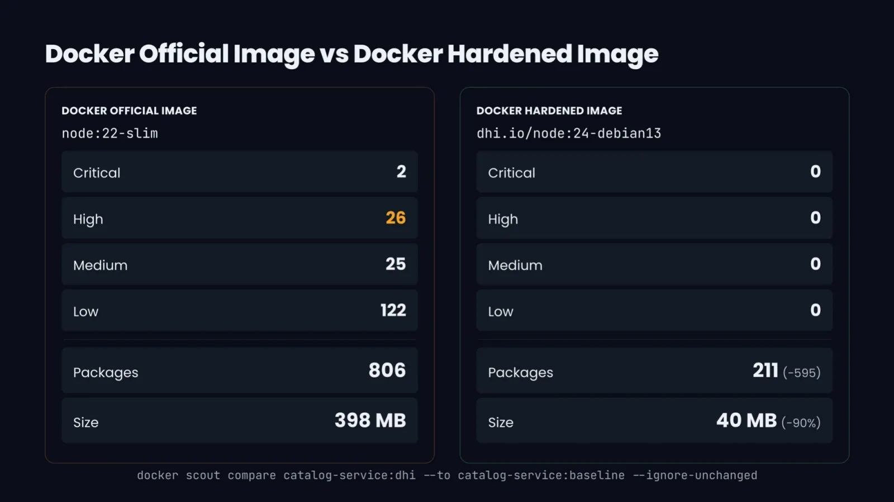

Note: Here's the same docker scout compare you'd run yourself. On the left, node:22-slim: 2 Critical, 26 High, 25 Medium, 122 Low, 806 packages, 398 MB. On the right, dhi.io/node:24-debian13: zero in every bucket. Packages drop from 806 to 211 - 595 fewer things to patch and audit - and size falls 90%, to 40 MB. Fewer packages is why there are fewer CVEs: you can't have a vulnerability in software you never shipped. That column of zeros is what a one-line base swap buys you.

---

<!-- chrome: false -->

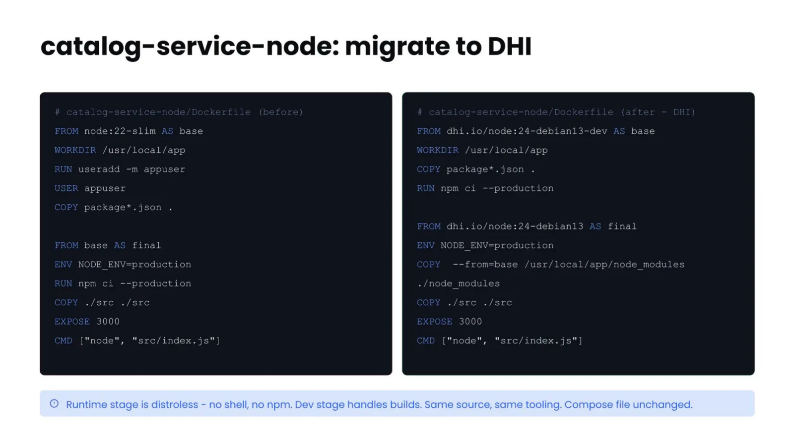

Note: This is the actual migration for catalog-service, before and after. The change that matters is the FROM line: node:22-slim becomes a two-stage build - dhi.io/node dev image for the build stage where you run npm ci, and the distroless final stage that copies node_modules across. Notice what drops out: no more RUN useradd, no USER appuser, because DHI already runs non-root. The runtime stage is distroless - no shell, no npm - the source is unchanged, and the Compose file doesn't change at all. This is a base swap, not a rewrite.

---

<!-- chrome: false -->

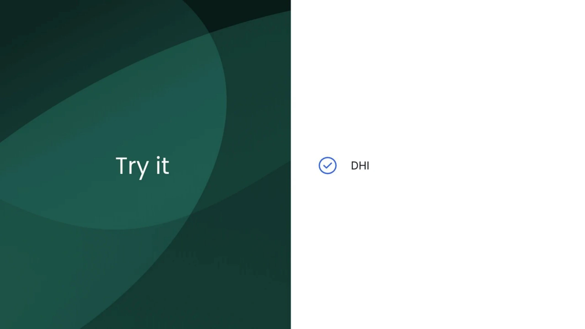

---

<!-- chrome: false -->

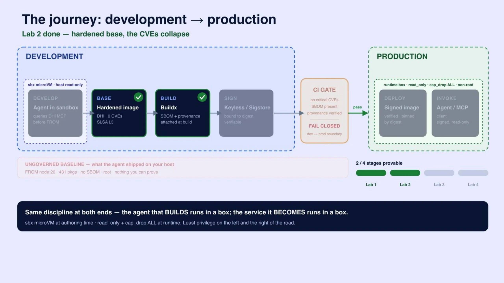

Note: Checkpoint two - Baseline turns green. The hardened image now feeds the build: DHI, 0 CVEs, SLSA L3, and the CVEs collapse right where we started this segment. 2 of 4 stages provable. The base and the build are both trustworthy now. Next we push toward the CI gate that turns all of this into an enforced boundary.

---

<!-- chrome: false -->

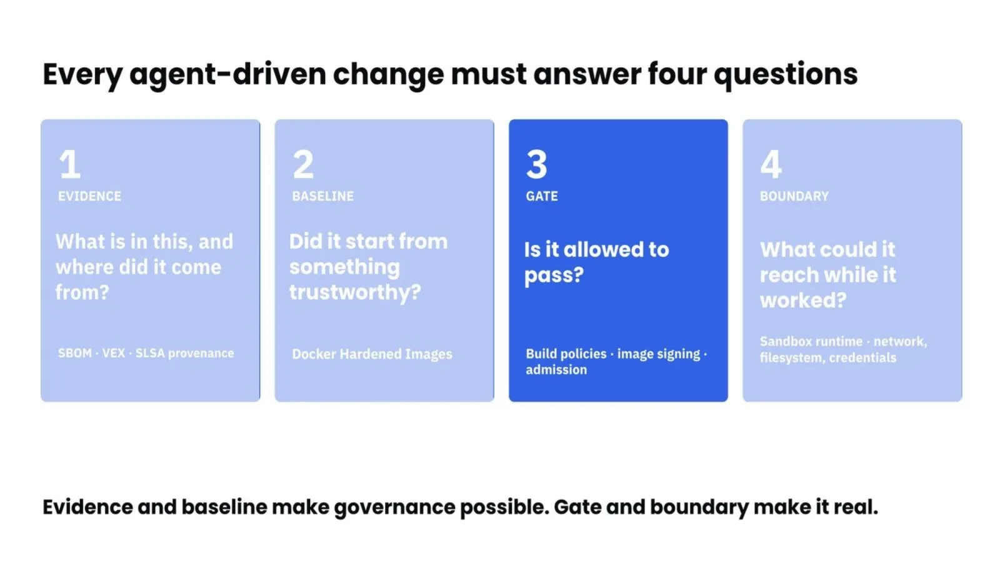

Note: Question three - Gate: is this artifact allowed to pass? The answer is build policies, image signing, and admission - the check in the middle of the pipeline that fails closed, so nothing crosses into production unless it's provable. Evidence and baseline made governance possible; this is where we make it real.

---

<!-- chrome: false -->

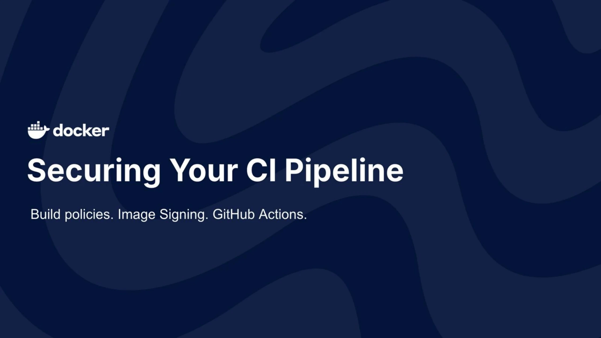

---

<!-- chrome: false -->

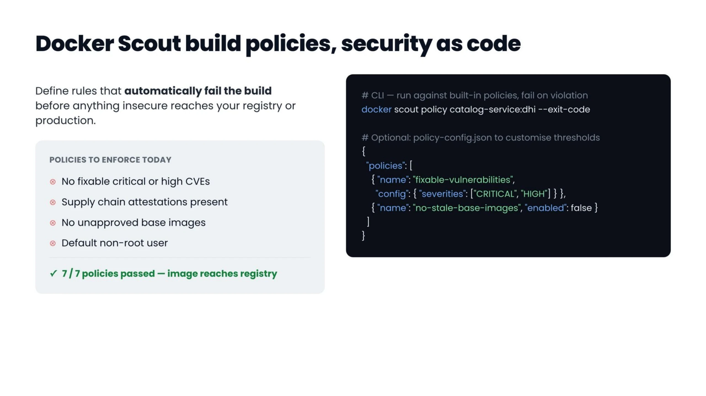

Note: This is security as code. Instead of a human eyeballing a scan report, you define rules that automatically fail the build before anything insecure reaches your registry. One command: docker scout policy --exit-code. That exit code is the whole point - non-zero stops the pipeline dead. The policies: no fixable critical or high CVEs, supply-chain attestations present, no unapproved base images, default non-root user. And it's tunable with an optional policy-config.json.

---

<!-- chrome: false -->

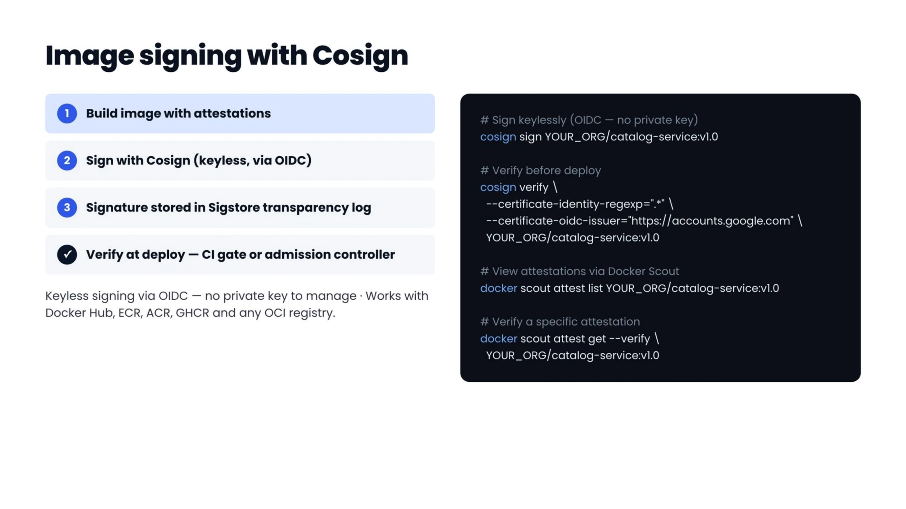

Note: Passing a policy tells you an image is clean; signing tells you it's authentic - that this exact digest is the one your pipeline produced and nobody swapped it. We use Cosign with keyless signing: build with attestations, sign via OIDC, the signature lands in the Sigstore transparency log, and you verify at deploy time. Keyless is the magic word - a short-lived certificate minted from your OIDC identity, so there's no private key to manage, rotate, or leak. Works with any OCI registry.

---

<!-- chrome: false -->

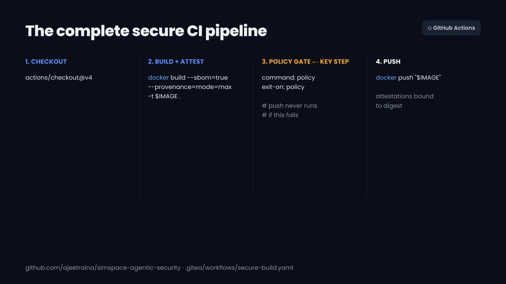

Note: Here's the whole secure pipeline in four steps on GitHub Actions. Checkout. Build and attest - SBOM and provenance generated at build time and bound to the digest. Then the key step, the policy gate: command policy, exit-on policy. That's the dev-to-prod boundary in one line - if any policy fails, the step exits non-zero and push never runs. Only when the gate passes do we reach push. The gate sits before the push on purpose: an unprovable image simply cannot be promoted.

---

<!-- chrome: false -->

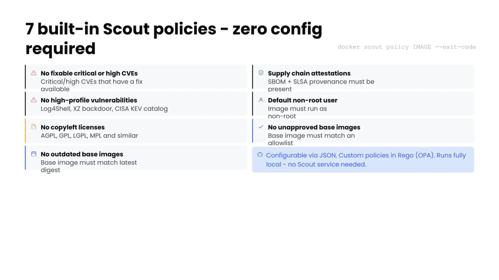

Note: These are the seven built-in Scout policies, and the headline is zero config required. Vulnerability side: no fixable critical or high CVEs, and no high-profile vulnerabilities - Log4Shell, the XZ backdoor, anything in CISA KEV. Hygiene: no copyleft licenses, no outdated base images, no unapproved base images. And the two that tie back to our supply-chain work: supply-chain attestations present, and default non-root user. All configurable via JSON, extensible with custom Rego policies, and it runs fully local - which matters for air-gapped pipelines.

---

<!-- chrome: false -->

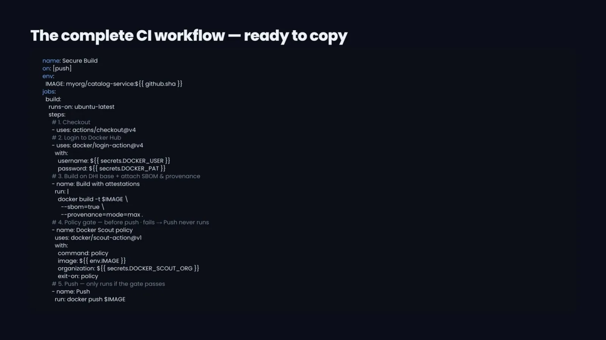

---

<!-- chrome: false -->

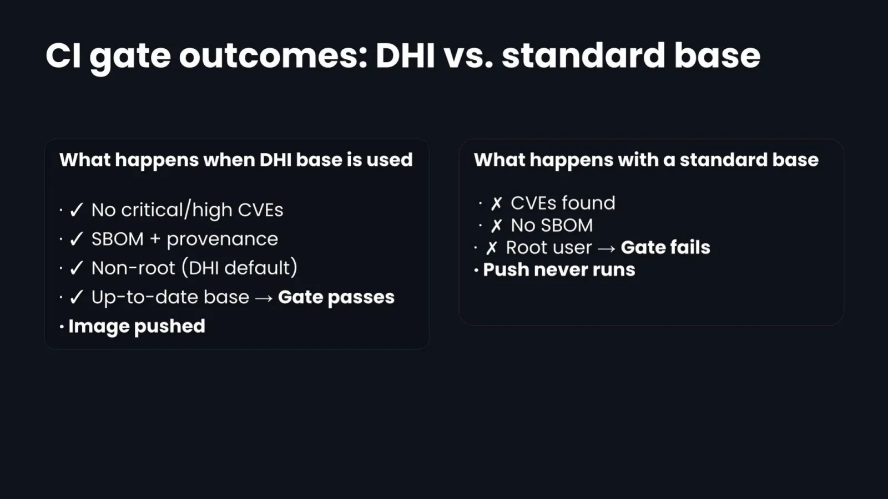

Note: Here's why all the earlier hardening pays off at the gate. With a DHI base: no critical or high CVEs, SBOM and provenance present, non-root, up-to-date - the gate passes, the image is pushed. With a standard base: CVEs found, no SBOM, running as root - the gate fails, push never runs. Same pipeline, same policies, opposite outcomes - the only variable is the base the agent built on. The hardened base isn't just hygiene; it's what lets you cleanly clear a fail-closed gate.

---

<!-- chrome: false -->

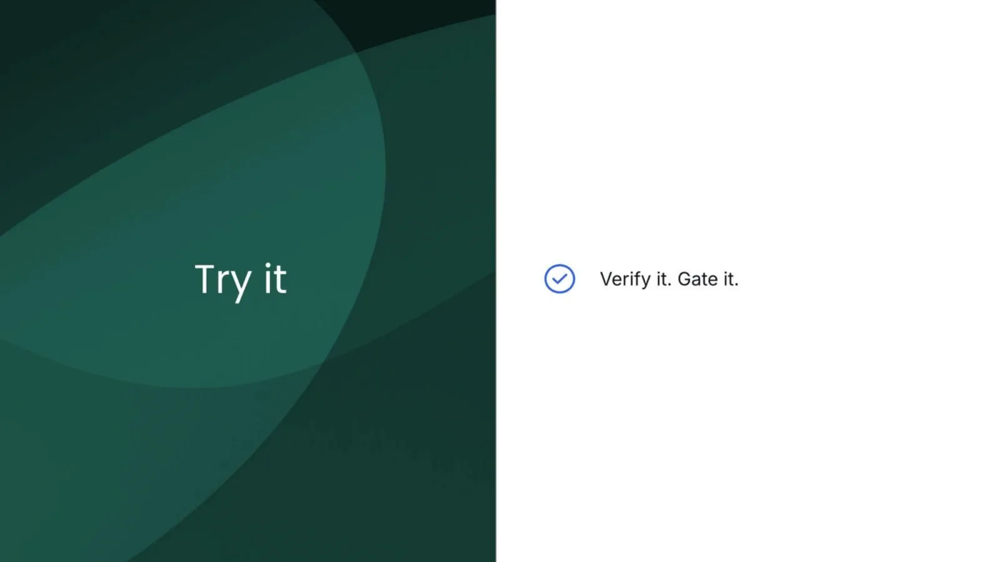

---

<!-- chrome: false -->

Note: Checkpoint three. Trace the road: the agent develops in a sandbox, builds on a hardened base with zero CVEs, attaches SBOM and provenance, and now SIGNs keylessly, bound to the digest. The CI GATE - no critical CVEs, SBOM present, provenance verified - fails closed at the dev-to-prod boundary, and because our image is provable it passes and gets promoted: DEPLOY goes green. Three of four stages provable. The one box still grey is INVOKE - the running agent and MCP client at the far right. Same discipline at both ends: the agent that builds runs in a box, and the service it becomes runs in a box too. That runtime end is next.

---

<!-- chrome: false -->

Note: Question four - Boundary: what could the agent reach while it worked? The answer is the sandbox runtime - network, filesystem, and credentials, bounded so the agent can act without an open blast radius. This is the layer that would have stopped both horror stories cold. It closes the loop: same discipline at both ends of the road.

---

<!-- chrome: false -->

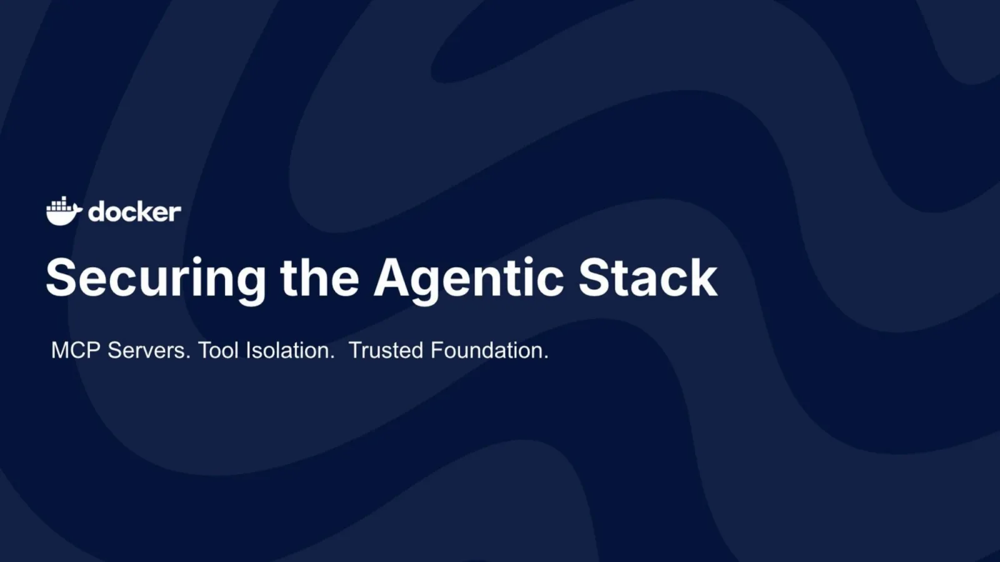

---

<!-- chrome: false -->

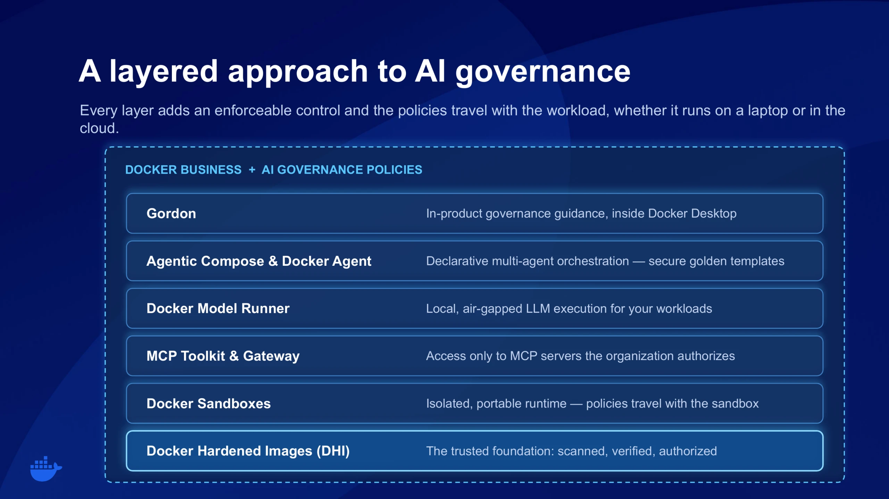

Note: Before we sandbox, here's the shape of the whole thing. Securing the agentic stack isn't one product - it's a layered set of enforceable controls, and the policies travel with the workload whether it runs on a laptop or in the cloud. Gordon gives in-product guidance; Agentic Compose and the Docker Agent give declarative, golden-template orchestration; Docker Model Runner keeps LLM execution local; the MCP Toolkit and Gateway limit agents to the servers you authorize; Docker Sandboxes give each agent an isolated runtime; and underneath it all, Docker Hardened Images are the trusted foundation. The next few slides zoom into that sandbox layer.

---

<!-- chrome: false -->

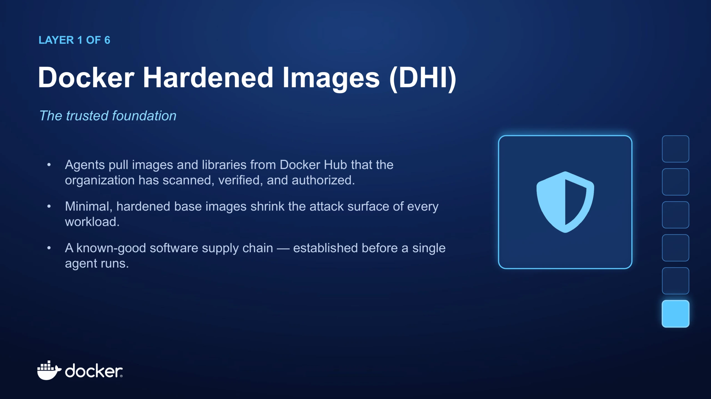

---

<!-- chrome: false -->

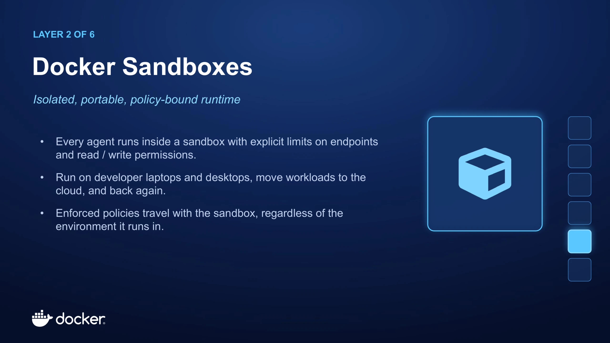

---

<!-- chrome: false -->

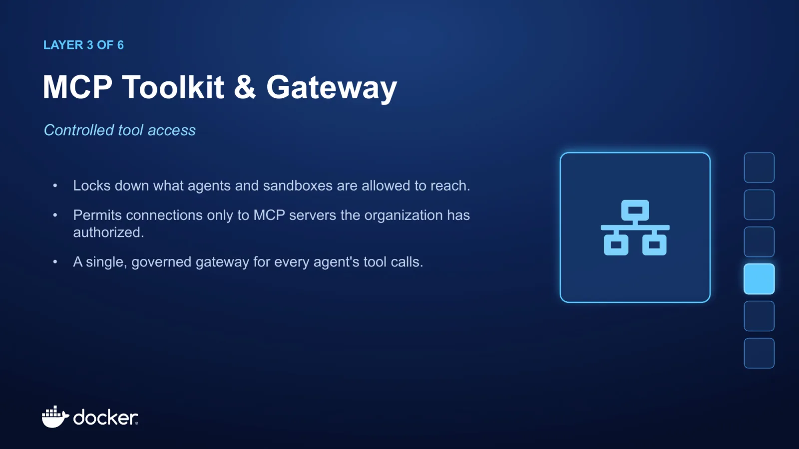

---

<!-- chrome: false -->

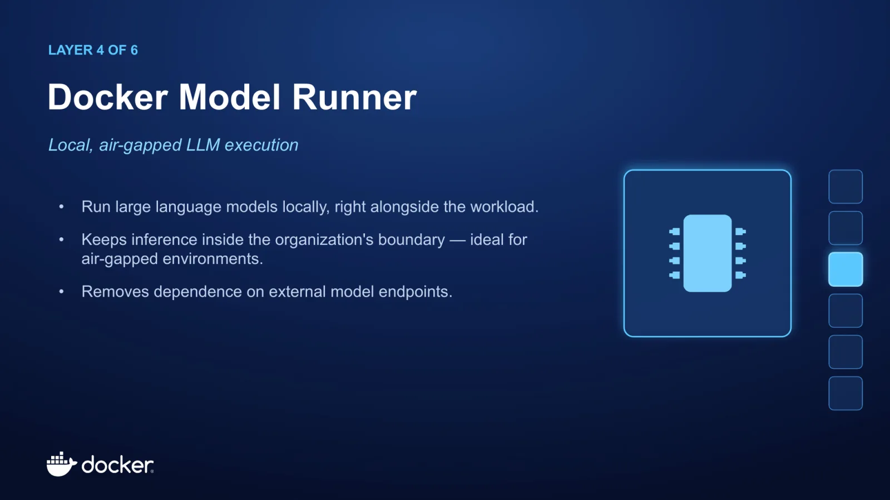

---

<!-- chrome: false -->

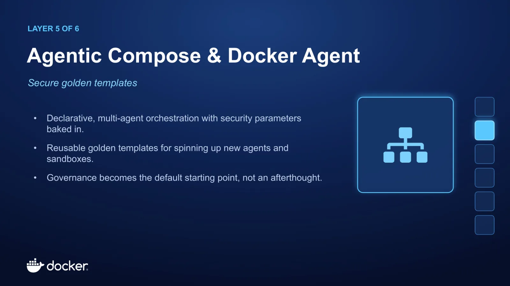

---

<!-- chrome: false -->

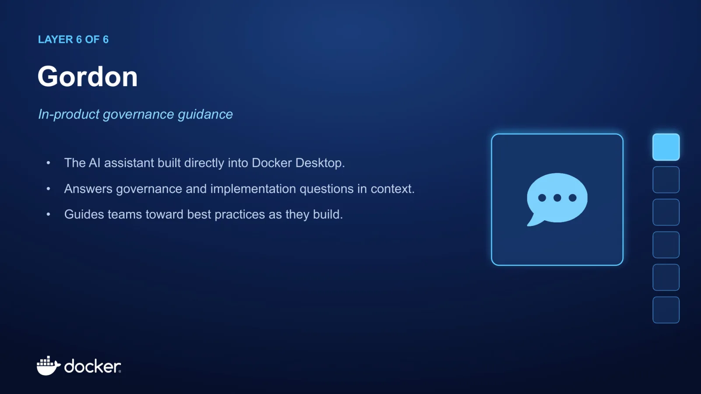

---

<!-- chrome: false -->

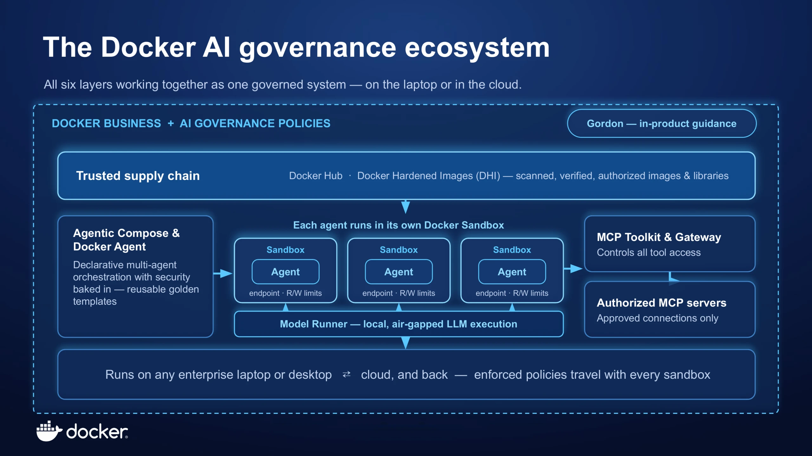

---

<!-- chrome: false -->

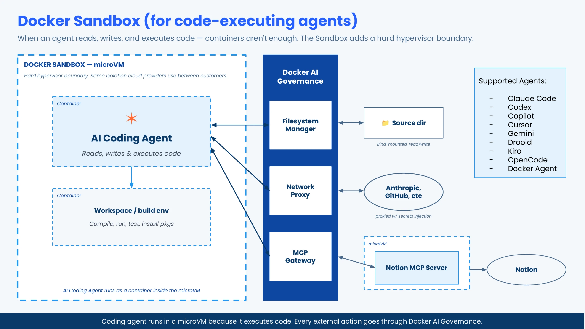

---

<!-- chrome: false -->

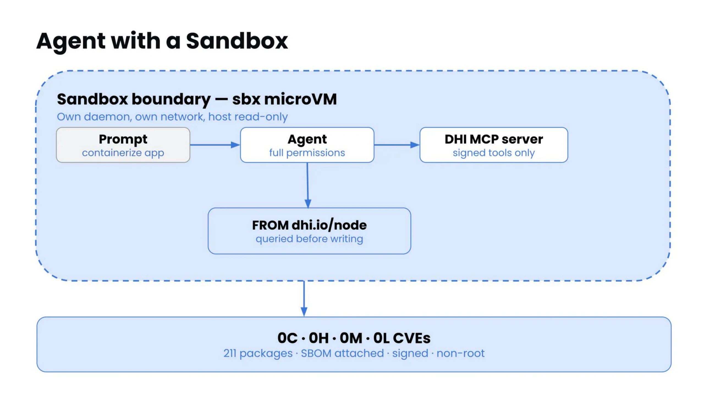

Note: This is the clean end-state - the counterpart to the ungoverned baseline from earlier. Everything the agent does now happens inside a sandbox boundary, an sbx microVM with its own daemon, its own network, and the host mounted read-only. Same prompt - "containerize app" - but the agent queries the DHI MCP server, which only serves signed tools, and writes FROM dhi.io/node because it checked the trusted source before writing the line. The result: 0 critical, 0 high, 0 medium, 0 low, 211 packages, SBOM attached, signed, non-root. Same agent, radically different outcome.

---

<!-- chrome: false -->

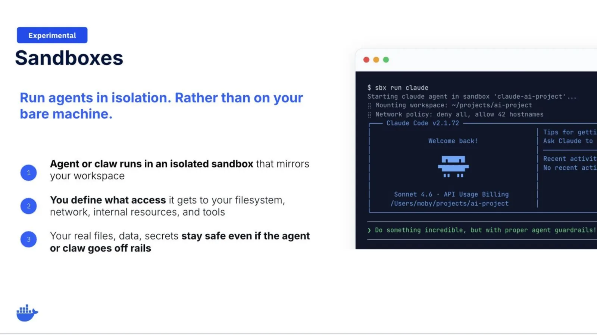

---

<!-- chrome: false -->

Note: Here's the architecture. Everything sits on your host, but the agent runs inside a microVM-based sandbox - a real isolation boundary, not just a container namespace. You feed it three things from outside the box: the workspace directories it's allowed to see, the network policies that govern what it can reach, and the secrets it needs. Outbound traffic doesn't go straight out - it flows through a network proxy that enforces those policies, and the proxy injects credentials so raw keys never enter the VM. The agent gets exactly the access you granted and nothing more.

---

<!-- chrome: false -->

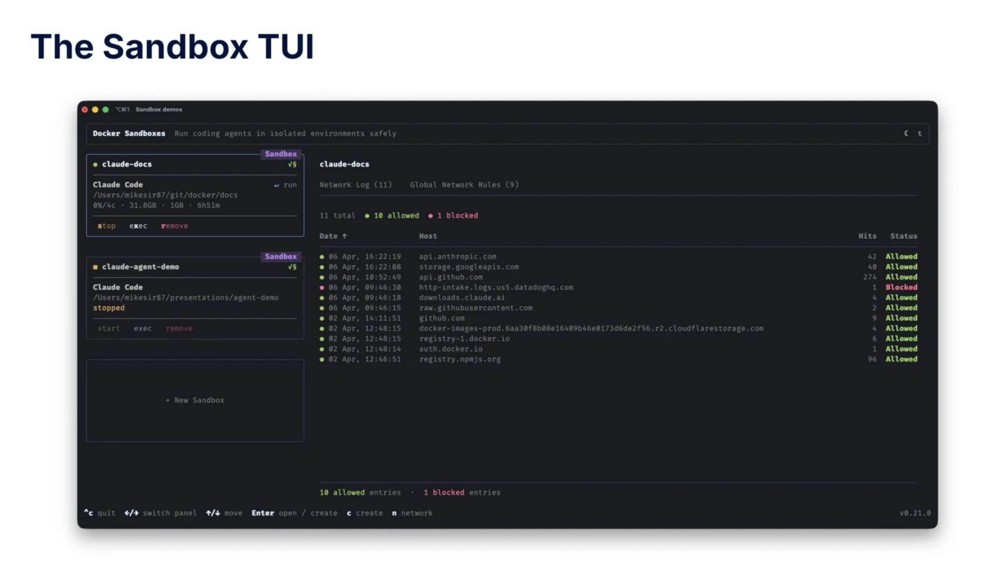

Note: This is the sbx TUI - a live view of every sandbox on your machine. On the left, each sandbox with its status, workspace, and resource use, with controls to stop, exec, or remove. On the right, the network log for the selected sandbox: every outbound connection the agent attempted, with a hit count and an allowed-or-blocked status. api.anthropic.com, api.github.com, registry.npmjs.org allowed - a datadog logs endpoint blocked. This is the boundary made observable: you can see exactly what the agent reached for and what the policy stopped. Hold that thought - it becomes the audit trail in our operations section.

---

<!-- chrome: false -->


---

<!-- chrome: false -->


---

<!-- chrome: false -->

Note: The other half of the boundary: the tools. An agent acts on the world through MCP servers, so those tools are part of your supply chain. The agent inside the sandbox never talks to servers directly - it talks to one endpoint, the mcp-gateway, through a single SBX_MCP_URL. Behind it, all your servers are aggregated. The payoff: every tool call flows through one chokepoint. That single point is where policy and audit apply - one place to govern instead of N servers to chase.

---

<!-- chrome: false -->


---

<!-- chrome: false -->


---

<!-- chrome: false -->


---

<!-- chrome: false -->

Note: And here's what the policy looks like - a default-deny allow-list over server-and-tool pairs, authored in Cedar, the open-source authorization engine from AWS. This example permits exactly one tool - get_me on github-official - and by default-deny, every other tool and every other server is blocked. It's evaluated at the gateway on every invoke, using the same engine as your network and filesystem policy - one surface, no bypass. Author once, sync everywhere: a developer can add any server they like, but if org policy doesn't permit its tools, the calls are denied and audited.

---

<!-- chrome: false -->


Note: Zoom out from one service to the whole stack - this is where vulnerabilities actually enter. On the left, without the DHI MCP the agent picks base images freely: the app on node:20, PostgreSQL, Kafka, aws-sdk - total stack exposure 2 Critical and 46-plus High. On the right, with the DHI MCP the agent queries first and every service resolves to a hardened image - and the whole column collapses to 0 across the board. The point isn't just that DHI is cleaner; it's that when the agent has to ask before it picks, the vulnerabilities never enter the stack in the first place.

---

<!-- chrome: false -->


---

<!-- chrome: false -->


---

<!-- chrome: false -->


---

<!-- chrome: false -->


---

<!-- chrome: false -->


Note: The final checkpoint, 4 of 4 - the whole road is green. On the left, DEVELOPMENT sits inside its own box: the agent develops in an sbx microVM with the host read-only, on a hardened base with 0 CVEs and SLSA L3, buildx attaches SBOM and provenance, and signing binds everything to a digest. In the middle, the CI GATE fails closed. On the right, PRODUCTION is boxed too: the signed image is deployed pinned by digest, and the agent invokes MCP as a signed, read-only client under cap_drop ALL and non-root. Same discipline at both ends. Four of four stages provable - and that's exactly the point where most talks stop. We're going two steps further.

---

<!-- chrome: false -->


Note: If you take one slide home, take this one - the framework, now seven steps. One: know what's in your images with SBOM and VEX. Two: verify where they came from with SLSA and signing. Three: start from a trusted base - DHI. Four: enforce at the pipeline with policies that fail closed. Five: isolate your agents with the sandbox and the MCP gateway. Those five were the labs. The two in green are what we added today: six, package that boundary as a hardened sbx kit pinned by digest, so it scales across the org without drift; and seven, operate and govern it in production - runtime hardening, an audit trail, and policy synced from the hub. Build it, box it, ship the kit, run it. That's the whole playbook.

---

<!-- chrome: false -->


---

<!-- chrome: false -->


---

<!-- chrome: false -->


---

<!-- chrome: false -->


---

<!-- chrome: false -->


---

<!-- chrome: false -->


---

<!-- chrome: false -->


Note: The payoff, and the callback to where we opened. When the next 2:47 AM happens, you don't run a forensics project - you ask. The sbx audit log shows every action the ops agent took: the Datadog queries it ran, allowed; the create_incident it tried, denied by the read-only policy; the paste-site it reached for, denied by the allowlist. And docker scout attest verifies the fix's provenance - builder and source commit, signed. But be honest about what the audit is: it records the connection, not the payload - that search_logs was called and allowed, not which log lines came back. It answers "what did the agent reach, and was it allowed?" - a governance trail, not content inspection or DLP. For request and response bodies you need app-level observability, a different layer. Same as always: policy authored once in Docker Hub, synced at login, fails closed, can't be overridden locally. And one line to land for the SOC: this stream doesn't stay in Docker - it forwards server-side from Docker Cloud to whatever SIEM your security team already lives in, Splunk, Datadog or Dynatrace, so the deny you just saw is searchable next to everything else they watch, and there's nothing on the agent's side to switch off. Who approved that build - and who touched it at 3am? Now both are a query.

---

<!-- chrome: false -->


---

<!-- chrome: false -->


---

<!-- chrome: false -->


Note: This is the demo, made concrete - Datadog and Docker AI Governance. The whalecollab org gives a coding agent one job: build and maintain the Product Catalog service. Governance allowlists exactly what that job needs - npm and pypi to install dependencies, api.anthropic.com so the LLM can write product copy - and denies everything else by default. So when the agent reaches for the production database on 5432, the Stripe payments API, or an unvetted image CDN - whether nudged by a prompt injection, a poisoned dependency, or just an over-eager plan - each one is denied at the connection, no human in the loop. And every decision streams to the security team's Datadog: they filter source:docker-audit, org whalecollab, decision DENY, and watch the denials land live - without ever seeing a line of source code or a single prompt. Governance is the platform guardrail every sandbox inherits and the SOC sees; the kit is how a team ships that same agent with an extra in-agent safety layer. Governance stops the connection, the kit stops the intent - defense in depth.

---

<!-- chrome: false -->


---

<!-- chrome: false -->


---

<!-- chrome: false -->


Note: Who approved that build? With evidence, a governed base, an enforceable gate, a boxed agent, a kit that spreads that boundary across the org, and an operations story that keeps it alive in production - the answer is: the same policy that approves every build, applied to the agent exactly as to a human, with a trail to prove it. Thank you - questions?
